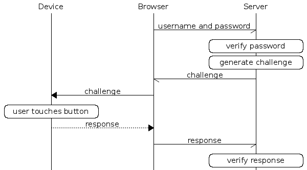
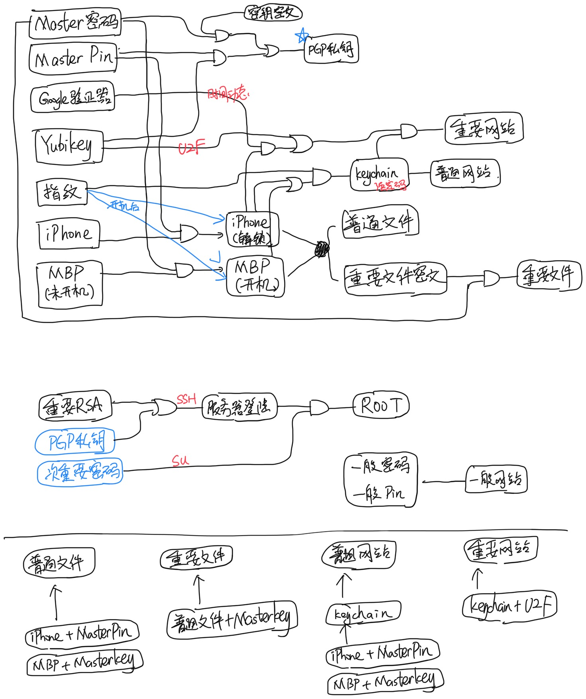

# 个人网络安全之重要性

在这个数字化时代，网络安全变得日益重要，各种信息极其容易被窃取（比如说斯诺登事件）。因此加密和认证就显得极其重要，而 YubiKey 就是这样一个简易的设备（支持 OTP、公钥加密签名、U2F 协议）。

# 关于 YubiKey

据 Wikipedia 描述：YubiKey 是由 Yubico 生产的身份认证设备，支持一次性密码（OTP）、公钥加密和身份认证，以及由 FIDO 联盟（FIDO U2F）开发的通用第二因素（U2F）协议。它让用户可以透过提交一次性密码或是使用设备产生的公开/私密金钥来安全地登录自己的帐户。针对不支持一次性密码的网站，YubiKey 也可以存储静态密码。Facebook 使用 YubiKey 作为员工凭证；Google 同时为雇员和用户提供支持。还有一些密码管理器也支持 YubiKey。

## 作为键盘设备（HID）

这是它主要介绍的功能，能够模拟键盘设备向电脑输入一串生成的密码，兼容性最好。其中还包含多种模式：OTP、Static、Challenge-Response、HTOP，

-   **OTP**：KEY_ID + AES(AES_KEY, SECRET, COUNT++)即生成的密码包含明文的 KEY_ID 和对称加密的（ SECRET 和计数器）。第一次使用前需要把 KEY_ID，AES_KEY，SECRET 提交至验证服务器（Yubico 提供或者自己搭建），之后应用程序每次通过服务器验证密码的可靠性（解码后 SECRET 对应、COUNT 增大（防止重放攻击））。
-   **Static**：静态密码。顾名思义，每次生成固定的一串密码（并没有什么用）。
-   **Challenge-Response**：HMAC(SECRET, INPUT)即可以通过 HID 接口给定一个输入，输出 HMAC 的计算结果。输入需要本地代码实现。
-   **HOTP**：HMAC(SECRET, COUNTER++)算法与 Challenge-Response 类似，然而使用累加计数器代替了输入，并且 HOTP 是一个标准协议，许多网站和设备都兼容该标准。

在 YubiKey 中包含两个配置插槽，每一个插槽可以单独配置以上模式中的其中一种，分别通过短触和长触来选择输入。

不过需要注意的是：以上都是基于对称加密的算法，也就是说，只要服务器端（验证服务器）的密文被泄漏，所有的信息理论上都可以进行伪造。

## U2F

U2F 是一个开源的认证标准协议，使用非对称加密算法，在每次需要认证是设备可以对 challenge 信息使用私钥进行签名来完成认证。作为一个开源的标准协议，Google、Dropbox 等网站都支持这种协议的两步验证，然而现阶段浏览器端仅有 Chrome 支持。

## OpenPGP Smart Card

YubiKey 还可以作为标准的 OpenPGP Smart Card 使用，用来存储 PGP 私钥（设备中私钥是可写不可读的，解密／签名操作在设备上完成）。

以上提到的三个功能是可以同时使用的，相互之间并不冲突。

# 个人安全模型

有了 YubiKey 就可以建立起一个稍微有效的个人安全模型，当然主要为了<s>装逼</s>

## 个人信息安全需求

人们对于保密的信息有两个基本需求：防止他人获取和确保自己能轻松访问。考虑到每个人都有多种不同级别的私密信息，我们需要一个多层次的安全模型。

## 密码个数

-   Master 密码
-   重要密码
-   一般网络密码
-   Masterpin
-   重要 pin
-   一般网络 pin
-   重要 RSA（密码为 Master 密码）
-   一般 RSA（无密码）
-   YubiKey（U2F，PIV，OTP...）
-   YubiKey PGPcard（可用于 ssh）
-   公开密码（公开的压缩包以及 wifi 热点）
-   公开 pin
-   其他特殊密码
    -   YubiKey 管理员 pin（8 位）

注：

密码主要分三套，Master，重要和一般。

Master 密码只用于在本地加密其他密文，以及作为 RSA 密钥的 passphrase。Masterpin 是所有重要本地设备的登录密码。

重要密码一般用得不多，主要是用于获取设备的操作权限，服务器上的 root 密码也会用到这个。重要 pin 会在所有非本地重要场合使用，例如银行卡支付密码。

一般密码和一般 pin 是指那些就算全被黑了也无所谓的网站之类，所以为了方便，设置一个简单的密码或 pin 统一管理，不用每次都打开 keychain 了。

YubiKey 主要用于辅助登陆和二次验证。

## 构成及解密方式

本人的日常设备以及加解密操作主要包括

-   重要 RSA
    -   passphrase——Master 密码
-   yubikey
    -   PIV——masterpin
    -   PGPcard——masterpin
    -   管理员 pin——8 位特殊 pin
-   MBP（保存一般和重要隐私文件）
    -   开机登陆输入密码——Master 密码
    -   解锁 Mac——指纹/Master 密码/yubikey 的 PIV
    -   进入 keychain——Master 密码
    -   命令行 sudo 权限/Master 密码/yubikey 的 PIV
    -   加密磁盘——Master 密码
    -   特殊加密文件——Master 密码/yubikeyPGP
-   iPhone（保存有一般和重要隐私文件）
    -   开机输入密码——Masterpin
    -   进入 keychain——指纹/Masterpin
-   备份硬盘（Mac 的加密备份）
    -   解密——Master 密码
-   VPS（用于实验各种操作）
    -   ssh 连接管理员用户——重要 RSA/yubikey 的 PGPkey
    -   管理员用户 sudo 或者切换 root 用户的密码——重要密码

## 个人安全模型

基于个人的需求，我的信息安全模型如下：

**除了 Master 密码外，所有的密码和用到的公私钥都用 Master 密码加密储存于一个外置存储设备上，而在本地以及云盘上，可以用 yubikey 的加密私钥非对称加密存储一份。**

### 成分

文件方面：

-   需要 Masterkey 进入 MBP 或 Masterpin 进入 iphone
-   开机锁屏状态下的电子设备加上指纹可以访问普通文件
-   在此基础上加上 PGPkey 才能访问重要文件

网站方面：

-   需要 Masterkey 进入 MBP 或 Masterpin 进入 iphone
-   开机锁屏状态下的电子设备加上指纹（Mac 要 Masterkey）可以访问 keychain
-   然后可以登陆普通网站
-   在此基础上有 yubikey 或 google 验证器才能访问重要网站

服务器方面：

-   需要重要 RSA + Masterkey 才能登陆
-   需要重要密码才能切换 root

## 安全性分析

假设一次只丢一个设备......注意 Master 密码只能用于本地设备，否则会不安全。

**并且我想保证，只丢一个设备，在只有 Masterkey 的情况下仍然可以干任何事情，但是 Masterkey 的保存是安全的**

1. yubikey 被偷

    - U2F 泄露

    但是 keychain 密码和 PGPkey 安全（没有 Masterpin），这时候去要

    1. 立即删掉这个 yubikey 的 U2F 权限
    2. 更换 PGPkey（revoke 掉原来的）——注意服务器的登陆 PGP
    3. 在 mac 上删除原来的 PIV

    可行性：到原来网站上全部重新用 google 验证器的 6 位 pin 将 yubikey 注销并且重新设置新 yubikey，用重要 RSA 到服务器上重新设置 ssh，用 master 登陆 mac 注销 PIV

2. iphone 被偷

    - 潜在 keychain 泄露

    需要立即把 iphone 远程格式化

    可行性：mac 仍可访问

3. mac 被偷

    没有 Master 密码应该没事......

    可行性：网盘和硬盘有备份，文件不会损失

4. 服务器被攻击

    - 最多泄露次重要密码和登陆的 RSA 公钥

    更换次重要密码
