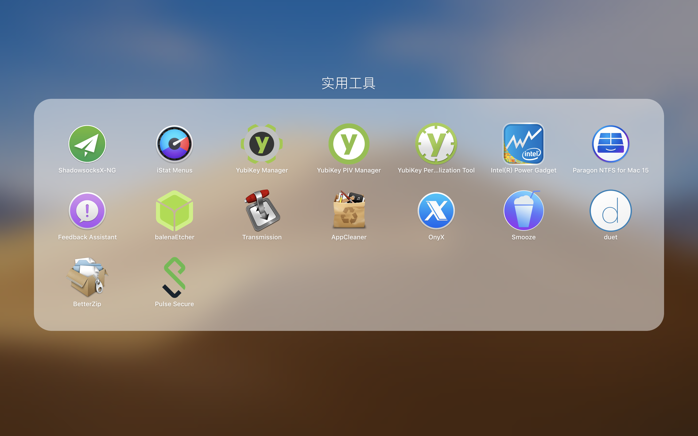

# 前言

本人也装过好多次电脑了，然而每次重装都要重新装软件，所以记录一下我都装了些啥软件，以免以后忘了。

# 列表

## adobe

-   Ps
-   Id
-   LR
-   Acrobat DC

## 理工科软件

-   Clion（有可能 Xcode 的 bug 比较多，配置比较烦，用 Clion 好很多）
-   Xcode（有很多软件会基于 Xcode 才能安装）
-   Anaconda（python 的环境管理器，有了这个就不用 python 不同环境繁琐的依赖管理了）
-   iTerm（命令行）
-   VSCode（万能文本编辑器）
-   LaTeX（论文排版）
-   Git（代码管理）
-   Pandoc（日常格式转换）
-   GeoGebra（几何画板）
-   Matlab（科学计算）

## 音视频软件

-   apple FCPX+LPX（音视频制作）
-   Kontakt（软音源）

## 多媒体

-   audirvana plus（音乐播放）
-   IINA（视频播放）
-   Bluray player（蓝光播放）
-   Foobar2000（Win/音乐播放）
-   Potpalyer（Win/视频播放）
-   Cyberlink（Win/蓝光播放）

## 工具

-   brew（macos 的包管理器）
-   VMware (Mac&Win/虚拟机)
-   其他小工具

    

## 日常

-   QQ
-   微信
-   百度云
-   steam
-   chrome
-   Office
-   PPSSPP
