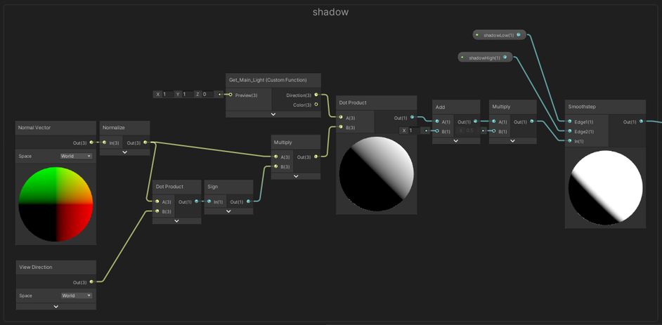

# 动漫风格化渲染

**【声明】本文内容全部基于个人观察，具体算法细节可能有所不同，也没必要完全相同，毕竟这只是一个 basline，供日后改进使用**

## 原神风格化渲染

选取原神作为 baseline，主要因为本人是原神玩家，同时原神的动漫风格化渲染一定程度上代表了业界主流做法，包含 ramp 采样阴影，屏幕空间边缘光，背向法线外扩描边，ilmMap 控制材质

演示界面为 unity 自带的 shader graph（然而目前 SG 不支持多 Pass，又只能写回 shader），其实用啥软件都可以，没有非常复杂的算法需要依赖于某些高级软件特性（可能获取深度图在某些软件中需要一丢丢工作量）

### 基础过程

动漫风格化渲染可以从 Unlit 开始：

base_sg

unlit

为了获得动漫的阴影硬边缘，需要依赖于 NdotL，并设定阈值：

NdotL_sg

hardShadow

如果希望过渡有彩色渐变，就需要依赖于一张 ramp，使用 NdotL 的值采样 ramp（原神采样 ramp 的公式为 saturate(NdotL + 1)，大于一的部分不采样 ramp 直接返回 1，就是那条白黄交界线）：

ramp_sg

ramp

### 边缘

边缘光和描边一样，都可以突出主体，原神人物边缘光为屏幕空间法线方向边缘光（叶子边缘光为光源方向），向法线方向偏移采样深度图，深度差大于阈值则使颜色变亮形成边缘光效果，宽度由偏移量控制，形成近似等宽的效果（这是相对于菲涅尔边缘光的优势）：

rim_sg

rim

描边就是背向法线外扩描边，此时模型法线需要使用平均法线。

### ilm

为了表现出材质区别，使用 ilm 标记区域，ilm 的通道分配直到现在，基本还是沿用罪恶装备的定义。R 通道表示材质粗糙度用于计算高光（各种高光算法其实都可以）；G 通道表示接受阴影（原神中 0 表示永远为阴影，0.5 表示正常，1 表示永远为亮，原神中阴影色是单独定义的颜色，和 ramp 中最深的颜色是不同的，这样可以在阴影中创造层次）；B 通道表示高光 mask（用于 mask 在 R 通道计算的高光）；A 通道原神中表示采样 ramp 图的第几条：

ilm

ilmBlend_code

ilmBlend

最终加上描边：

sphere

（不要问我本村线，那种反人类的东西我是不会弄的）

### 脸部 SDF 阴影

脸部如果使用上述阴影会使得脸部很脏，目前工业界主要使用球形法线和 SDF。球形法线可以使阴影分界线退化为一条线，但是会不能表现面部细节，而 SDF 可以展现面部轮廓，但只能随着光源的水平方向改变阴影（就是太阳高度变化不会引起阴影的改变），这也是原神中采用的方法

球形法线也广泛用于树和头发上，但是在头发上效果个人认为并不好，不过头发的风格化阴影也是一个相当开放的话题，目前没有一种非常好的算法

具体实现为将脸部的 Front Vector 与光源点乘得到 FdotL，这是一个全脸相同的值，然后和采样得到的 SDFshadow 比较，如果 NdotL 比 SDFshadow 值大，则认为这个点在光照下，反之在阴影中（这边使用 SG 连特别乱，还是用 shader 写比较明了）：

SDFShadow_code

faceNdotL

faceSDF

SDFShadow

这样，一个最基础的 baseline 就完成了，具体色彩倾向需要进行 tonemapping，而我这边直接加上 ACES 和 Bloom 就输出了：

baseline

## 改进

有很多细节都是可以优化的，随便举一些例子：

1. 皮肤的 sss 次表面散射处理
2. 眼睛的动态高光（double lobe）
3. 阴影的进一步改进（Siggraph Asia 2021 的 Shading Rig)
4. 描边的优化（ SIGGRAPH Asia 2021 的 Physically-based Feature Line Rendering）
5. （开放）动态的 blend shape 让人物更贴近动漫平面风格
6. （开放）头发的渲染方法以及阴影的绘制

有空再慢慢做了
